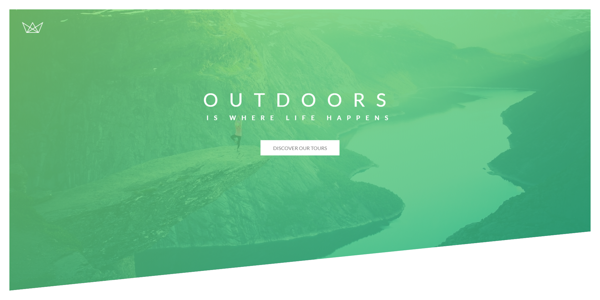

<h3 style="text-align:center;font-weight: 300;" align="center">
  
</h3>

<p align="center">
  
  
  
</p>


> Natours: Let's make some CSS, I mean... Legit looking CSS 🔥


## Progress

#### Day 2

🍇 🍈 🍉 🍊 🍋 🍌 🍍 🍎 🍏 🍐 🍑 🍒 🍓 🥝 🍅

🍈 `background-color: purple !important;` : !important property gives priority to cascade specificity. Use carefully due to its conflicting nature against scalability.

🍉 Specificity Example:

```css
/* Highest specificity */
#nav div.pull-right a.button{
    background-color: orangered;
}

/* When hover, should turn the screen yellow */
#nav a.button:hover {
    background-color: yellow;
}
```


```html
  <nav id="nav">
      <div class="pull-right">
          <a class="button button-danger" href="link.html"> Don't click me! </a>
      </div>
  </nav>
```

```css
body {
    padding: 50px;
}

.button {
    font-size: 20px;
    color: white;
    background-color: blue;
}

a {
    background-color: purple;
}

/* Highest specificity */
#nav div.pull-right a.button{
    background-color: orangered;
}

/* When hover, should turn the screen yellow */
#nav a.button:hover {
    background-color: yellow;
}

```


## Daily End Product:



## License

🌱 MIT 🌱

---

>  [yuzhoujr.com](http://www.yuzhoujr.com) &nbsp;&middot;&nbsp;
>   [@yuzhoujr](https://github.com/yuzhoujr) &nbsp;&middot;&nbsp;
>   [@yuzhoujr](https://linkedin.com/in/yuzhoujr)
