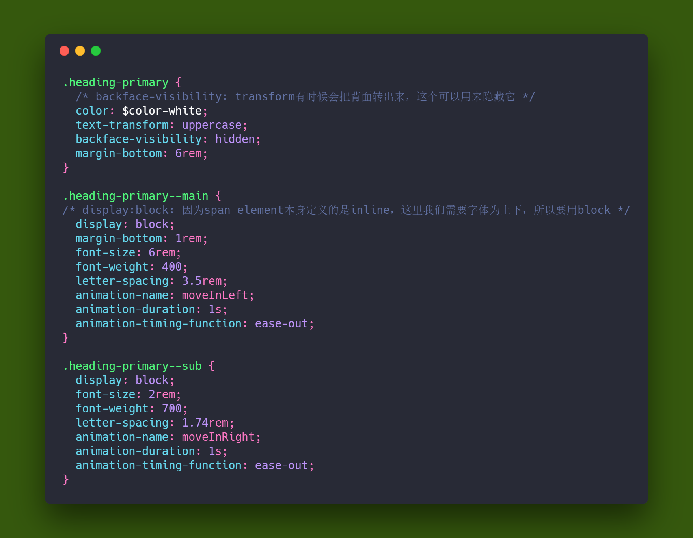
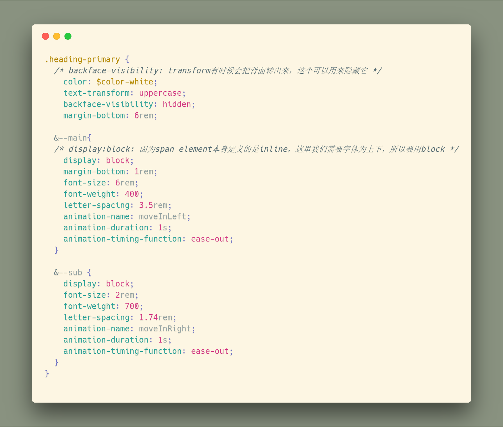
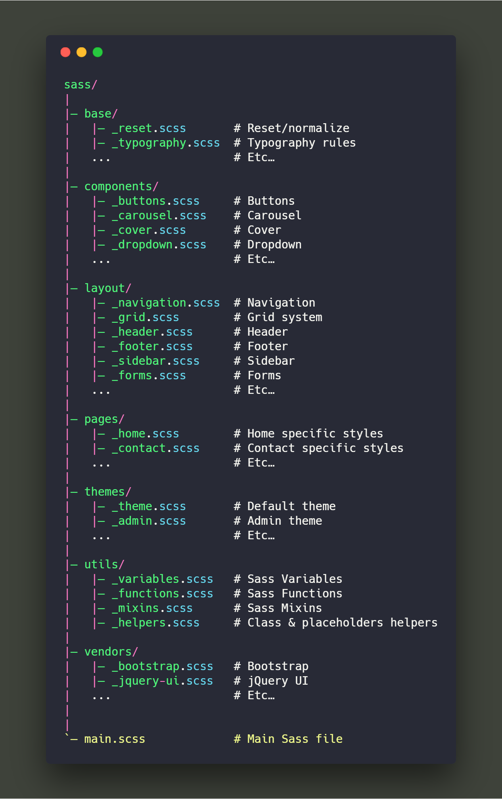

<h3 style="text-align:center;font-weight: 300;" align="center">
  
</h3>

<p align="center">
  
  
  
</p>

> Natours: Let's make some CSS, I mean... Legit looking CSS 🔥

## Progress
#### Day X | Sass Refactoring

<!-- 🍍 🍎 🍏 🍐 🍑 🍒 🍓 🥝 🍅 🥥 -->

##### Sass Refactoring

`Sass` allows a `parent` selector to include `child` selector if prefix are the same, using the properties along with `BAM` naming convention, the code becomes **art**......

Example:

🍈 `before`



🍊 `after`



---
##### Sass 7-1 Pattern

🍌 `7-1 Refactoring` : To make a front-end project easier to scale, having a structured design is important. This project follows the Sass 7-1 pattern as listed below:



Our main.scss now have a brand-new look:
```scss
@import "abstracts/functions";
@import "abstracts/mixins";
@import "abstracts/variables";

@import "base/animations";
@import "base/base";
@import "base/typography";
@import "base/utilities";

@import "components/button";

@import "layout/header";

@import "pages/home";

```

---

## License

🌱 MIT 🌱

---
>  [yuzhoujr.com](http://www.yuzhoujr.com) &nbsp;&middot;&nbsp;
>   [@yuzhoujr](https://github.com/yuzhoujr) &nbsp;&middot;&nbsp;
>   [@yuzhoujr](https://linkedin.com/in/yuzhoujr)
